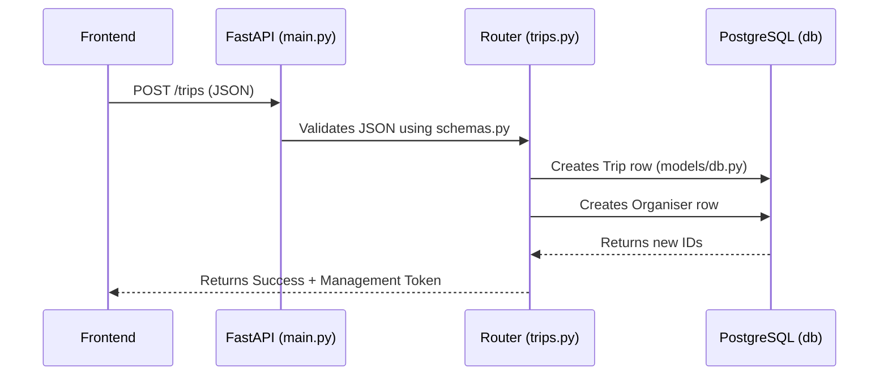

# PackVote Code Architecture Notes

If you're finding the raw code a bit overwhelming to read, don't worry! This document breaks down exactly how the different pieces of code we've written so far fit together and why they exist.

---

## 1. Environment & Package Management (Step 0)

Before writing any actual app code, we needed to make sure Python knows where all our libraries (like `fastapi`, `sqlalchemy`, and `pytest`) are.

- **`environment.yml`**: This is a Conda file. Conda is our isolated sandbox. By running `conda env create`, we created a dedicated folder (`env/`) on your machine that holds Python 3.11.
- **`pyproject.toml`**: This is the modern Python standard for declaring what libraries your app needs to run. Notice the `[project.optional-dependencies]` section—that lets us install development tools (like `pytest`) only when we need them.
  
> [!NOTE] 
> Because we ran `pip install -e ".[dev]"`, your code in the `src/` folder is installed in "editable" mode. This means if you change a python file, you don't have to reinstall the package for Python to see the change.

---

## Step 1: Backend Foundation

Now we move to building the core backend services, database connections, and API logic.

### 2. Shared Schemas (`src/packvote/shared/schemas.py`)

In web applications, data flows between the Frontend (what the user sees) and the Backend (the server). 
We use **Pydantic** (`BaseModel`) to define exactly what shape that data should be.

For example:
```python
class TripCreate(BaseModel):
    name: str
    dates_rough: str
    participant_count: int
    organiser_email: str
```
By placing this in `shared/schemas.py`, **both** our Streamlit frontend and our FastAPI backend can import and use the exact same definition, avoiding duplicate code and preventing bugs!

---

### 3. The Database Engine (`core/config.py` & `core/database.py`)

To talk to our PostgreSQL database, we need two things: the password/connection string, and a "Session".

- **`core/config.py`**: We use Pydantic's `BaseSettings`. This automatically reads your `.env` file and creates a Python object `settings` that holds your keys (like `OPENAI_API_KEY`). This prevents us from hardcoding passwords into the script.
- **`core/database.py`**: We use **SQLAlchemy**. The `engine` is the main connection to the database. The `SessionLocal` is a factory that gives us a temporary "session" to talk to the database. 
- **`get_db()`**: This is a FastAPI dependency. Whenever an API endpoint needs database access, it asks for `get_db()`. FastAPI opens the session, runs the API logic, and securely closes the database connection when it's done.

---

### 4. Database Models (`models/db.py`)

While `schemas.py` defines the shape of data *traveling over the internet*, `models/db.py` defines the shape of data *saved in the database*.

```python
class Trip(Base):
    __tablename__ = "trips"
    id = Column(UUID(as_uuid=True), primary_key=True, default=uuid.uuid4)
    name = Column(String, nullable=False)
    # ...
```
This SQLAlchemy code translates Python classes directly into SQL Tables. 

> [!TIP]
> Notice the `Vector(1536)` column in the `Destination` model? That is the `pgvector` extension at work! It allows us to store AI embeddings directly alongside our relational data, so we don't need a separate expensive Vector Database service.

---

### 5. The API Endpoints (`routers/trips.py` & `main.py`)

This is the actual server that listens for web requests. 

- **`main.py`**: The entry point. We define `app = FastAPI()`. When the server boots up, it also runs `Base.metadata.create_all(bind=engine)`, which looks at your models in `db.py` and automatically creates those tables in PostgreSQL.
- **`routers/trips.py`**: This file contains the logic for what happens when someone visits a specific URL. 

### The Flow of `POST /trips`
When the frontend sends a request to create a trip:
1. FastAPI receives JSON data and uses `schemas.TripCreate` to validate that `name` and `organiser_email` are present.
2. We ask for a database session using `Depends(get_db)`.
3. We create a new `Trip` database model and `db.add(new_trip)`.
4. We also create a `Participant` row specifically for the organiser (`is_organiser=True`), so they can participate in their own trip.
5. We commit the changes to the database and return a `TripOut` schema back to the frontend.

---

### 6. Seeding Data (`scripts/seed_destinations.py`)

To recommend destinations, our AI needs a knowledge base.
1. We wrote `seeds/destinations.json` containing 4 sample Indian destinations.
2. The `seed_destinations.py` script reads that JSON, converts the descriptions into numbers (embeddings) using OpenAI, and inserts them into the `destinations` table in Postgres. 

Currently, because we don't have an OpenAI key in the `.env` file, the script intelligently skips the OpenAI call and just saves dummy zero-vectors `[0.0, 0.0, ...]` so the database is populated and our app doesn't crash during testing.

---

### Summary Workflow diagram



---

## Step 2: Survey Data Layer

### Overview
In Step 2, we built the API layer that handles participant responses to the survey. After a trip is created (Step 1), participants are given unique links. This step is all about receiving their destination swipes (likes/dislikes), budget constraints, and unavailable dates securely.

### Key Components Built

1. **`routers/responses.py` (The main logic for receiving survey data)**
   - **Endpoint: `POST /responses`**
     - **Validation:** When a participant submits their survey, they send their `participant_token`. We query the database to ensure this token exists and grab the associated participant and trip records.
     - **Status Guard:** Before saving the response, we strictly check `if trip.status != TripStatus.survey`. If the trip is already closed, voting has started, or it's still in setup, we reject the response. This prevents data corruption or late submissions from messing up the pipeline.
     - **Idempotency (No double-voting):** We check `if participant.responded:`. If they already submitted their survey, we reject it.
     - **Saving the Data:** We store their `swipes`, `budget_max`, and `unavailable_dates` into the `responses` table as JSONB. Then we mark the participant's `responded` column as `True`.
     - **Pipeline Trigger:** Once a response is saved, we check if *all* participants in the trip have responded. If `responded_participants >= total_participants`, the backend automatically triggers the LangGraph recommendation pipeline using FastAPI's `BackgroundTasks`. This means the pipeline runs asynchronously without making the last participant wait for the AI to finish before getting a success message.
     - **A/B Testing Prompt Logic:** When triggering the pipeline, we added a coin flip (`random.random() > 0.5`) to pass either `v1` or `v2` as the `prompt_version`. This will be used in Step 4/5 to dynamically pull different prompts from LangSmith Hub for A/B testing.

2. **`GET /trips/{id}/status` (Dashboard Polling Fallback)**
   - We created this simple endpoint to return the current status (e.g., `survey`, `reveal`, `voting`).
   - *Why?* Later, we will implement WebSockets for live dashboard updates, but mobile browsers or bad networks often drop WebSocket connections. This REST endpoint acts as a reliable polling fallback.

3. **`POST /trips/{id}/force-close` (Organiser Manual Override)**
   - **Why we need it:** What if a group has 5 people, but 1 person refuses to respond? The pipeline would be deadlocked forever waiting for them.
   - **How it works:** The organiser can hit this endpoint using their `management_token` to authenticate (so random participants can't close the trip). It bypasses the "wait for everyone" rule and immediately triggers the LangGraph pipeline with whatever partial responses have been collected so far.

4. **Schema Updates (`shared/schemas.py`)**
   - We added `ForceCloseRequest` to securely receive the `management_token` from the organiser.
   - We added `ForceCloseResponse` so the organiser gets feedback on how many people actually responded before they closed it (e.g., "Closed with 4/5 responses").

5. **Integration & Testing (`tests/test_responses.py`)**
   - We wrote tests to simulate the entire flow:
     - Creating a trip and participants.
     - Simulating the trip moving to the `survey` phase.
     - Submitting a valid survey and asserting it's saved.
     - Attempting to submit a second survey and verifying the API rejects it.
     - Triggering the `/force-close` endpoint to verify the organiser's token validation works properly.

### How this connects to the next steps
Now that the backend can successfully receive survey data, the very next step (Step 3) is to build the frontend Streamlit UI (`2_survey.py`) so real users can click "Like" or "Dislike" on destinations and send that data to this `POST /responses` endpoint. Once that's done, we will build the LangGraph AI pipeline (Step 4) that gets triggered in the background.
